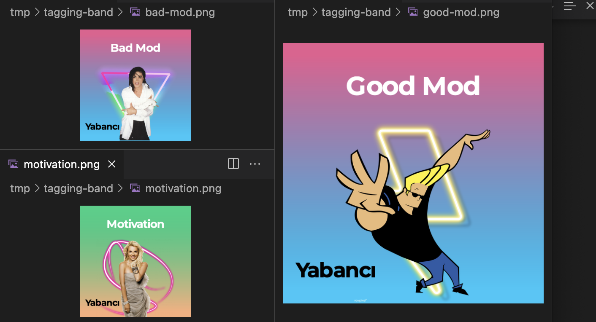

# think-about-spotify

Example of generate new cover image for album. It's a simple and extensible. It's not a boilerplate. Just funny idea for codding. Maybe you want to combine with your recomender system. Maybe you want to process for your e-commerence tagging. I just show sharpjs tech and 'm talking about what you able to do with that.

## Initialize
- Download Montserrat font from google-fonts.
- Setup this font in your machine.
- npm install
- node index.js

Change functions and keep your funny.

## Examples of output
[]
[]